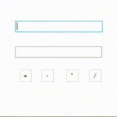

# Windows-Forms
## Программа
- **Microsoft Visual Studio**
# Актуальность

Windows Forms является одним из самых популярных и востребованных платформенных инструментов для разработки приложений под операционную систему Windows. С его помощью можно создавать разнообразные приложения: от простых инструментов для работы с текстом и изображениями до сложных систем управления базами данных и бизнес-приложений.

Одной из особенностей Windows Forms является удобство и простота создания интерфейсов пользовательского приложения. В нем есть большой набор готовых элементов управления, таких как кнопки, текстовые поля, списки и т.д., которые легко можно настроить под свои нужды.

Кроме того, Windows Forms обладает высокой степенью совместимости с другими технологиями Microsoft, такими как .NET Framework и Visual Studio. Это делает возможным использование множества готовых библиотек и инструментов для ускорения разработки приложений.

В целом, можно сказать, что Windows Forms по-прежнему является актуальным и востребованным инструментом для разработки приложений под Windows, особенно в контексте создания корпоративных приложений.

## Теория по созданию калькулятора на Windows Forms

<p align="center">
<br>
<i>Пример работы калькулятора</i>
</p>  


Первым шагом создайте новый проект в Visual Studio. Для этого выберите File-> New-> Project и выберите шаблон Windows Forms Application.

Далее, перейдите в Toolbox и найдите контрол TextBox. Добавьте его на форму, где пользователь будет вводить или выводить числа.

Теперь нужно добавить кнопки для операций. Найдите контрол Button в Toolbox и добавьте четыре: для сложения, вычитания, умножения и деления.

Напишите код обработчиков событий для каждой кнопки.

Код будет выглядеть следующим образом:

```cpp
private: System::Void button1_Click(System::Object^ sender, System::EventArgs^ e) {
		double num1, num2, result;

		num1 = System::Convert::ToDouble(textBox1->Text);
		num2 = System::Convert::ToDouble(textBox2->Text);

		result = num1 + num2;

		textBox3->Text = System::Convert::ToString(result);
	}
 ```

Здесь мы объявляем три переменные num1, num2, result  и выполняем операцию сложения. Затем выводим результат в окне textBox3 при этом преобразуем текст в String.

Аналогично нужно написать обработчики для кнопок вычитания, умножения и деления.

## Автор

* VK: <a href="https://vk.com/ismail2003">Алиев Исмаил</a>
* Почта: aliev.ismail.2003@gmail.com
